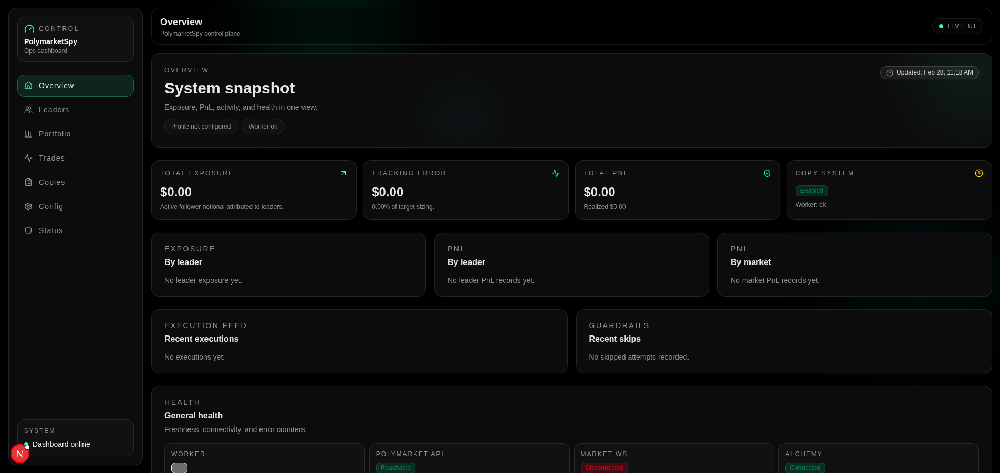

# polymarket-copier

## Project Overview

`polymarket-copier` is a self-hosted copy-portfolio system for Polymarket.

It watches one or more public leader accounts and mirrors their portfolio exposure into your follower account at a configurable ratio. Instead of replaying every single trade, it continuously targets the leader's current net exposure and rebalances your account toward that target using configurable guardrails.

At a high level, the system works like this:

- Ingest leader activity and positions from Polymarket Data API (with on-chain websocket triggers for low-latency detection).
- Build target follower exposure by applying your copy ratio to leader positions.
- Net deltas and apply execution guardrails (minimum notional, slippage, spread, cooldown, retries).
- Submit signed CLOB orders from the worker and track outcomes in the dashboard.

Dashboard preview:

## Quick Start (Host-run Web/Worker + Docker infra)

1. Create local env file:
   - `cp .env.example .env`
2. Set your follower L1 signing key in `.env`:
   - `POLYMARKET_FOLLOWER_PRIVATE_KEY=0x...`
3. Generate/derive Polymarket L2 CLOB API credentials:
   - `pnpm polymarket:creds`
   - paste `POLYMARKET_API_KEY`, `POLYMARKET_API_SECRET`, `POLYMARKET_PASSPHRASE` into `.env`
4. If your Polymarket account uses a proxy/safe wallet, also set:
   - `POLYMARKET_SIGNATURE_TYPE=POLY_PROXY` or `POLY_GNOSIS_SAFE`
   - `POLYMARKET_FUNDER_ADDRESS=0x...`
5. Optional execution cap:
   - set `MAX_PRICE_PER_SHARE_USD` to block BUY attempts above your chosen per-share price (leave blank to disable)
   - optional per-leader override: on the Leader detail page, set `maxPricePerShareUsd` to override (or clear) the global cap for that leader only
6. Install dependencies:
   - `pnpm install`
7. Validate workspace:
   - `pnpm typecheck`
8. Start local dev infra only (Postgres + Redis):
   - `pnpm dev:infra:up`
9. Apply migrations:
   - `pnpm db:migrate`
10. Run web + worker from host:
   - `pnpm dev:web`
   - `pnpm dev:worker`

## Quick Start (Full Docker Stack)

1. Create local env file:
   - `cp .env.example .env`
2. Set `POLYMARKET_FOLLOWER_PRIVATE_KEY` and Polymarket L2 API credentials in `.env`
3. Install dependencies:
   - `pnpm install`
4. Start full stack with Docker Compose:
   - `pnpm compose:up`

## Polymarket Trading Credentials

- Order placement requires both:
  - L1 signer: `POLYMARKET_FOLLOWER_PRIVATE_KEY`
  - L2 CLOB API credentials: `POLYMARKET_API_KEY`, `POLYMARKET_API_SECRET`, `POLYMARKET_PASSPHRASE`
- The worker signs orders with the follower private key (EIP-712 / L1) and submits them over the CLOB API using L2 credentials.
- L2 credentials are also used for authenticated CLOB operations and the user-channel WebSocket.
- For proxy/safe account setups, configure:
  - `POLYMARKET_SIGNATURE_TYPE` (`EOA`, `POLY_PROXY`, `POLY_GNOSIS_SAFE`)
  - `POLYMARKET_FUNDER_ADDRESS` (required for proxy/safe modes)
- Troubleshooting:
  - If the Copies page shows `not enough balance / allowance` while your portfolio has cash, verify signing mode:
    - `EOA` mode checks signer-wallet USDC/allowance.
    - proxy/safe-funded accounts must use `POLY_PROXY` or `POLY_GNOSIS_SAFE` plus `POLYMARKET_FUNDER_ADDRESS=<your profile address>`.
- Safety behavior:
  - If `EXECUTION_ENGINE_ENABLED=true` and required signing config is missing/invalid, the worker fails startup intentionally.

## GitHub Auth / Allowlist

- The web dashboard is protected by GitHub OAuth.
- Access is controlled by `AUTH_GITHUB_ALLOWED_USERS` (comma-separated GitHub usernames/handles).
- To grant access to multiple people, add each GitHub username to the same env var separated by commas.
- To add another user later, append their username to the list and restart the web app/container.
- Example:
  - `AUTH_GITHUB_ALLOWED_USERS=alice,bob,carol`
- Spaces are okay (`alice, bob, carol`), and matching is case-insensitive.
- Use GitHub usernames (the `login`/handle), not display names.
- After changing the allowlist, restart the web app/container so the new env value is loaded.
- Full setup instructions (GitHub OAuth App, callback URLs, local/prod examples): `authguide.md`

## Services (Docker Compose)

Compose and Docker assets live under `docker/`:
- `docker/docker-compose.yml`
- `docker/docker-compose.dev-infra.yml`
- `docker/Dockerfile`
- `docker/Dockerfile.dockerignore`
- `docker/nginx/default.conf`

- `nginx` -> public entrypoint on `http://localhost:8080` (configurable via `NGINX_PORT`)
- `web` -> Next.js dashboard
- `worker` -> copy engine process with health endpoint on `/health`
- `postgres` -> durable data store (named volume)
- `redis` -> cache/ephemeral store (named volume)
- `migrate` -> one-shot Prisma migration job that must complete before `worker` starts

## Dev Infra Commands

- Start Postgres + Redis only:
  - `pnpm dev:infra:up`
- Stop Postgres + Redis only:
  - `pnpm dev:infra:down`
- Inspect Postgres + Redis containers:
  - `pnpm dev:infra:ps`
- Tail Postgres + Redis logs:
  - `pnpm dev:infra:logs`

## Health Checks

- `nginx`: `GET /health`
- `web`: `GET /api/health`
- `worker`: `GET /health`
- `worker user channel`: `GET /user-channel/status`
- `postgres`: `pg_isready`
- `redis`: `redis-cli ping`

## DB Commands

- Generate Prisma client:
  - `pnpm --filter @copybot/db generate`
- Apply migrations:
  - `pnpm --filter @copybot/db migrate:deploy`
- Check migration status:
  - `pnpm --filter @copybot/db migrate:status`
- Seed bootstrap data:
  - `pnpm --filter @copybot/db seed`
- Run DB integration test:
  - `pnpm --filter @copybot/db test:integration`

## Reset Database

Use this when you want a clean local DB (all data removed, migrations re-applied from scratch).

1. Stop running app processes (`dev:web`, `dev:worker`) so they do not race the reset.
2. Reset schema and data:
   - `sh -ac 'set -a; . ./.env; set +a; pnpm --filter @copybot/db exec prisma migrate reset --force --skip-seed --schema prisma/schema.prisma'`
3. Regenerate Prisma client:
   - `pnpm --filter @copybot/db generate`
4. Optional: seed bootstrap data:
   - `pnpm --filter @copybot/db seed`
5. Start apps again:
   - `pnpm dev:web`
   - `pnpm dev:worker`

Notes:
- This is destructive and deletes all local Postgres data for this app schema.
- If your DB is managed by Docker and you want to wipe volumes too, run:
  - `docker compose -f docker/docker-compose.dev-infra.yml down -v`
  - then `pnpm dev:infra:up` and run the reset command above.
